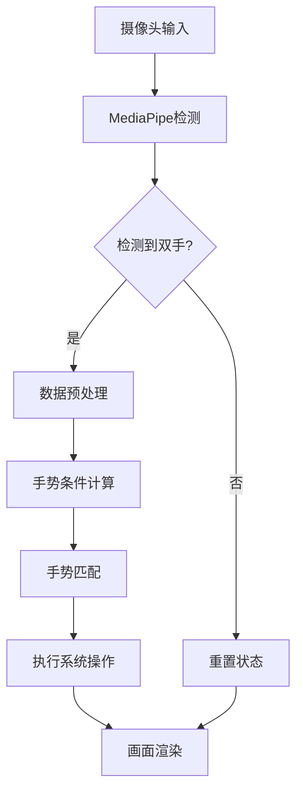

# GestureRecongnition - 基于MediaPipe的手势识别与控制


[English Readme](https://github.com/LeoLeeYM/GestureRecognition/blob/main/README_EN.md)

## 目录
1. [项目架构](#1-项目架构)  
2. [环境配置](#2-环境配置)  
3. [手势开发全流程](#3-手势开发全流程)  
4. [核心模块详解](#4-核心模块详解)  
5. [调试与优化](#5-调试与优化)  
6. [API参考](#6-api参考)  
7. [最佳实践](#7-最佳实践)  

---

## 1. 项目架构

### 系统流程图


### 模块说明
| 模块          | 功能     | 关键类/函数             |
| ------------- | -------- | ----------------------- |
| core.py       | 主控流程 | Hands, cv2.VideoCapture |
| data.py       | 数据计算 | UpdateData()            |
| gestureLib.py | 手势定义 | UpdateGesture()         |
| handle.py     | 动作映射 | Handle()                |
| tool.py       | 工具函数 | GetFingerAverage()      |

---

## 2. 环境配置

### 硬件要求
- 支持 480p 的摄像头
- 推荐CPU：Intel i5 8代+ 或同级别 CPU
- 内存：8GB+

### 软件依赖
```python
# requirements.txt
opencv-python==4.5.5.64
mediapipe==0.8.9.1
pyautogui==0.9.53
pywin32==303
```

### 安装验证
```bash
# 检查MediaPipe模型加载
python -c "import mediapipe as mp; mp.solutions.hands.Hands()"
# 预期输出：无报错信息
```

---

## 3. 手势开发全流程

### 3.1 手势定义规范
1. **条件要素**：
   - 相对坐标：使用手掌根部(0号点)为原点
   - 绝对坐标：基于图像坐标系(0.0-1.0)
   - 三维深度：z值表示远近(近正远负)

2. **开发模板**：
```python
# gestureLib.py
def UpdateGesture(...):
    global gesture_自定义名称
    gesture_自定义名称 = [
        # X轴条件
        (条件1 and 条件2),
        # Y轴条件 
        (数据对比表达式),
        # 综合条件
        tool.Get...() < 阈值
    ]
```

### 3.2 手势开发示例：👌 OK手势

#### 步骤1：定义手势条件
```python
# gestureLib.py
gesture_ok = [
    # 拇指与食指接触
    abs(data.finger_x[0] - data.finger_x[1]) < 0.03,
    # 其他三指闭合
    data.finger_y[2] > data.originY + 0.15,
    data.finger_y[3] > data.originY + 0.15,
    data.finger_y[4] > data.originY + 0.15,
    # 手腕到中指的纵向距离
    data.originY - data.finger_y[2] < 0.1
]
```

#### 步骤2：添加处理逻辑
```python
# handle.py
def Handle(...):
    # 在起始判断区域添加
    elif not False in gestureLib.gesture_ok:
        nowStart = 'ok'
        pyautogui.press('space')  # 执行空格键操作
        
    # 添加持续手势检测
    if nowStart == 'ok':
        if time.time() - start_time > 0.5:
            pyautogui.press('volumemute')  # 长按静音
```

### 3.3 手势条件设计原则

| 条件类型 | 典型表达式                    | 说明         |
| -------- | ----------------------------- | ------------ |
| 位置约束 | `data.finger_x[0] > 0.7`      | 限制手指区域 |
| 相对位置 | `finger_y[1] < originY - 0.1` | 基于手腕位置 |
| 运动趋势 | `current_x - last_x > 0.05`   | 检测移动方向 |
| 复合条件 | `(条件A or 条件B) and 条件C`  | 组合逻辑     |

---

## 4. 核心模块详解

### 4.1 data.py 数据模型

#### 坐标系说明
```python
# 归一化坐标系示例
landmark.x  # [0.0, 1.0] 图像宽度比例
landmark.y  # [0.0, 1.0] 图像高度比例 
landmark.z  # 相对深度（数值越小距离越远）
```

#### 关键数据结构
```python
# 各手指尖坐标（索引0-4对应拇指到小指）
finger_x = [x1, x2, x3, x4, x5]  
finger_y = [y1, y2, y3, y4, y5]

# 手指间差异统计
fingerDiffAverage_x = sum(abs(xi - xj)) / 20
```

### 4.2 tool.py 工具函数

#### 坐标转换原理
```python
def GetChangeCoordinateForScreen(x, y):
    # 获取实际屏幕分辨率
    hDC = win32gui.GetDC(0)
    physical_w = win32print.GetDeviceCaps(hDC, win32con.DESKTOPHORZRES)
    physical_h = win32print.GetDeviceCaps(hDC, win32con.DESKTOPVERTRES)
    
    # 计算缩放系数（默认150%映射）
    return (
        int(x * physical_w * 1.5),
        int((1-y) * physical_h * 1.5)  # Y轴反向
    )
```

---

## 5. 调试与优化

### 5.1 可视化调试方法

#### 关键点标注
```python
# core.py 添加标注
for landmark in hand_landmarks.landmark:
    x = int(landmark.x * frame.shape[1])
    y = int(landmark.y * frame.shape[0])
    cv2.circle(frame, (x,y), 5, (0,255,0), -1)

# 显示数据面板
debug_text = f"""
Thumb: {data.finger_x[0]:.2f}
Index: {data.fingerDiffAverage_x:.3f}
State: {nowStart}"""
y0, dy = 30, 30
for i, line in enumerate(debug_text.split('\n')):
    cv2.putText(frame, line, (10, y0+i*dy),
                cv2.FONT_HERSHEY_SIMPLEX, 0.6, (0,255,0), 2)
```

### 5.2 性能优化指南

#### MediaPipe参数调优
```python
# core.py 配置优化
hands = mp_hands.Hands(
    static_image_mode=False,  # 实时视频模式
    max_num_hands=1,          # 限制检测手数
    min_detection_confidence=0.7,  # 检测置信度
    min_tracking_confidence=0.5    # 跟踪置信度
)
```

#### 手势条件优化策略
1. **阈值分级**：  
   ```python
   if condition > 0.7:    # 主要条件
   elif condition > 0.5:  # 次要条件
   ```
   
2. **时序过滤**：  
   ```python
   if gesture_detected and (time.time() - last_trigger > 1):
       execute_action()
   ```

---

## 6. API参考

### 6.1 手势数据API

| 函数                      | 说明               | 示例                                      |
| ------------------------- | ------------------ | ----------------------------------------- |
| `GetFingerAverage()`      | 获取多指坐标均值   | `tool.GetFingerAverage((0,1), 'x')`       |
| `GetFingerJointAverage()` | 获取关节位置均值   | `tool.GetFingerJointAverage((2,3), 'y')`  |
| `GetFingerAverageDiff()`  | 计算手指间平均差异 | `tool.GetFingerAverageDiff((0,1,2), 'x')` |

### 6.2 系统操作API

| 操作     | 实现方式                        | 参数说明           |
| -------- | ------------------------------- | ------------------ |
| 鼠标移动 | `pyautogui.moveTo(x, y)`        | 屏幕绝对坐标       |
| 滚动     | `pyautogui.scroll(ticks)`       | 正数上滚，负数下滚 |
| 按键     | `pyautogui.press('volumedown')` | 支持系统媒体键     |

---

## 7. 最佳实践

### 7.1 手势设计原则
1. **特征显著性**：选择差异大的手势作为触发条件
2. **容错设计**：添加±10%的阈值缓冲区
3. **状态隔离**：使用`nowStart`变量防止误触发

### 7.2 常见问题解决

#### 问题：手势误识别
**解决方案**：  
```python
# 添加复合条件
gesture_自定义 = [
    main_condition,
    data.fingerAverage_z > -0.05,  # 排除远距离误判
    tool.GetFingerAverageDiff((3,4), 'x') < 0.1  # 辅助条件
]
```

#### 问题：响应延迟
**优化方法**：  
```python
# 降低处理频率
if time.time() - last_process < 0.1:  # 100ms间隔
    return
last_process = time.time()
```

---
